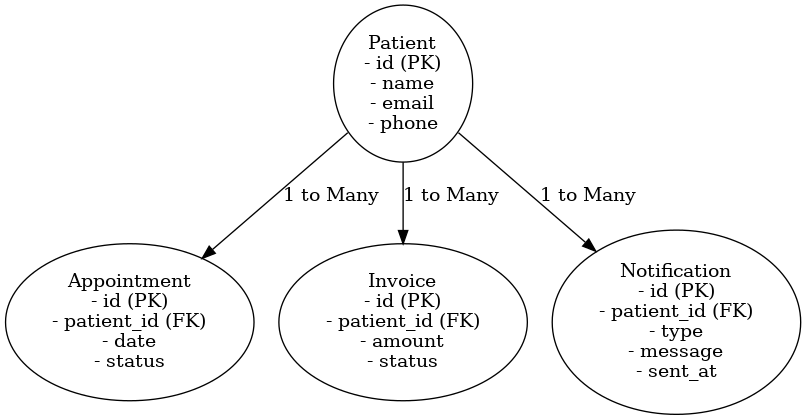

# MRI Care Manager API

## 📖 Overview
This API manages patient records, appointments, invoices, and notifications. It is built using **FastAPI** and follows a structured Entity-Relationship model.

## 📊 Entity Relationship Diagram (ERD)


## 🚀 Features
- Patient Registration  
- Appointment Scheduling  
- Invoice Management  
- Notification System  

## 📌 API Endpoints

### 🏥 Patients
- `POST /patients/` → Register a new patient  
- `GET /patients/` → Get all patients  
- `GET /patients/{id}/` → Get a specific patient  
- `PUT /patients/{id}/` → Update patient details  
- `DELETE /patients/{id}/` → Remove a patient  

### 📅 Appointments
- `POST /appointments/` → Schedule an appointment  
- `GET /appointments/` → List all appointments  
- `GET /appointments/{id}/` → Get appointment details  
- `PUT /appointments/{id}/` → Update an appointment  
- `DELETE /appointments/{id}/` → Cancel an appointment  

### 💰 Invoices
- `POST /invoices/` → Generate a new invoice  
- `GET /invoices/` → List all invoices  
- `GET /invoices/{id}/` → Get an invoice  
- `PUT /invoices/{id}/` → Update an invoice  
- `DELETE /invoices/{id}/` → Delete an invoice  

### 🔔 Notifications
- `POST /notifications/` → Send a notification  
- `GET /notifications/` → View notifications  
- `DELETE /notifications/{id}/` → Delete a notification  

## 🔧 **Setup & Installation**
1. Clone the repository  
   ```sh
   git clone https://github.com/yourusername/CIDM6330-Spring2025.git
   cd CIDM6330-Spring2025/Assignment 2
